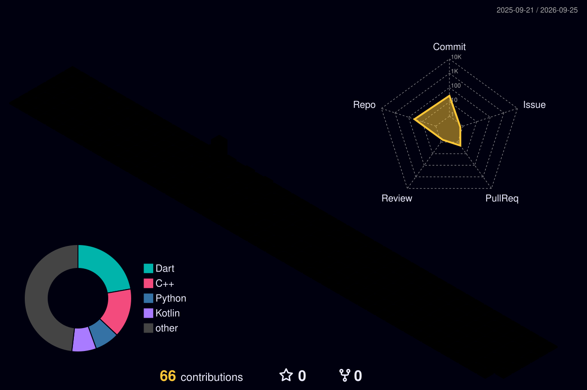

# Hi, I'm Serdar! 👋

  

## 🚀 About Me

I am an aspiring **Flutter Developer** passionate about building beautiful, high-performance mobile applications.

I enjoy turning complex problems into simple, elegant code.

- 🔭 **Current Focus:** Building mobile applications with Flutter
- 🌱 **Learning:** Clean Architecture, Advanced State Management & Dart Internals
- 📱 **Interested in:** Mobile Development, UI/UX and Product Engineering
- ⚡ **Fun Fact:** I love Flutter's Hero animations

---

## 🛠 Tech Stack

---

## 👾 Pac-Man Contributions

  <picture>
    <source
      media="(prefers-color-scheme: dark)"
      srcset="https://raw.githubusercontent.com/Serdar0000/Serdar0000/output/pacman-contribution-graph-dark.svg"
    />
    <source
      media="(prefers-color-scheme: light)"
      srcset="https://raw.githubusercontent.com/Serdar0000/Serdar0000/output/pacman-contribution-graph.svg"
    />
    
  </picture>

---

## 🌌 3D Contribution Graph

  

---

---

## 📬 Let's Connect

---

  <i>“Code is like humor. When you have to explain it, it’s bad.”</i>

